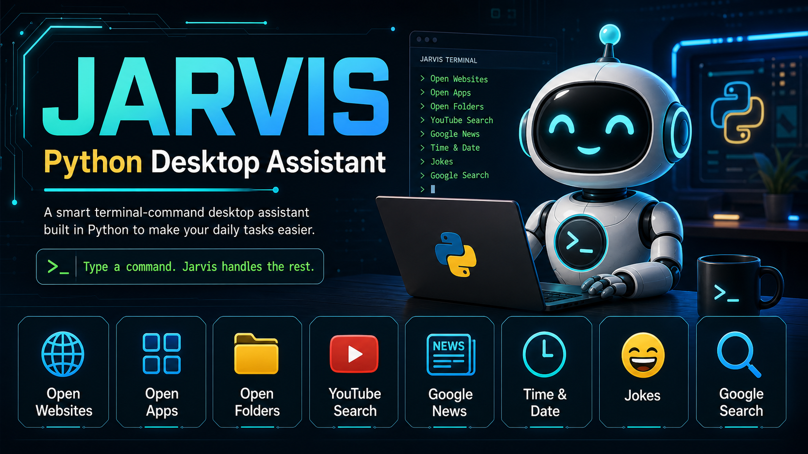

# Jarvis - Python Desktop Assistant



Jarvis is a terminal-based Python desktop assistant built for quick local tasks. It accepts typed commands, speaks responses using text-to-speech, opens websites, launches Windows apps, opens folders, searches YouTube, opens Google News, tells the time/date, tells programming jokes, and falls back to Google Search for unknown commands.

This version is designed to be reliable on normal desktops and laptops without requiring a microphone, speech recognition, API keys, databases, or paid cloud services.

## Features

- Open popular websites: Google, YouTube, Gmail, Instagram, WhatsApp Web, and GitHub.
- Launch Windows applications: Notepad, Calculator, Paint, and Command Prompt.
- Open common local folders: Desktop, Downloads, Documents, and Pictures.
- Search or play songs through YouTube search results.
- Open Google News top stories.
- Tell the current time and date.
- Tell random programming jokes using `pyjokes`.
- Search Google automatically for unknown commands.
- Speak responses using `pyttsx3`.
- Stop cleanly with `exit`, `quit`, or `stop`.

## Architecture

The project includes a visual architecture page:

[View Architecture Diagram as Webpage](https://code-with-akki010.github.io/jarvis-python-desktop-assistant/architecture.html)


## Tech Stack

| Technology | Purpose |
| --- | --- |
| Python | Main programming language |
| `pyttsx3` | Offline text-to-speech output |
| `pyjokes` | Random programming jokes |
| `webbrowser` | Opens websites, YouTube searches, Google News, and Google fallback search |
| `subprocess` | Launches Windows desktop applications |
| `os.startfile` | Opens local folders on Windows |
| `pathlib` | Builds user-folder paths |
| `datetime` | Gets current time and date |
| `urllib.parse.quote_plus` | Safely formats search queries for URLs |

## Installation

Clone this repository:

```powershell
git clone https://github.com/your-username/jarvis-python-desktop-assistant.git
cd jarvis-python-desktop-assistant
```

Install the required packages:

```powershell
pip install pyttsx3 pyjokes
```

If `pyttsx3` does not speak on your system, check that Windows text-to-speech voices are installed and enabled.

## Run The Project

Start Jarvis from the project folder:

```powershell
python main.py
```

Expected output:

```text
Jarvis: Initializing Jarvis
Type command for Jarvis:
```

Type a command and press Enter.

## Supported Commands

| Command | Action |
| --- | --- |
| `open google` | Opens Google |
| `open youtube` | Opens YouTube |
| `open gmail` | Opens Gmail |
| `open instagram` | Opens Instagram |
| `open whatsapp` | Opens WhatsApp Web |
| `open github` | Opens GitHub |
| `open notepad` | Opens Notepad |
| `open calculator` | Opens Calculator |
| `open paint` | Opens Microsoft Paint |
| `open cmd` | Opens Command Prompt |
| `open desktop` | Opens the Desktop folder |
| `open downloads` | Opens the Downloads folder |
| `open documents` | Opens the Documents folder |
| `open pictures` | Opens the Pictures folder |
| `play believer` | Opens YouTube search results for the song |
| `search youtube python tutorial` | Searches YouTube for a topic |
| `news` | Opens Google News top stories |
| `time` | Tells the current time |
| `date` | Tells today's date |
| `joke` | Tells a random programming joke |
| `tell me about virat kohli` | Searches Google for the topic |
| `exit` | Stops Jarvis |
| `quit` | Stops Jarvis |
| `stop` | Stops Jarvis |

## Example Usage

```text
Type command for Jarvis: open notepad
Jarvis: Opening notepad

Type command for Jarvis: time
Jarvis: The time is 02:30 AM

Type command for Jarvis: joke
Jarvis: [random joke from pyjokes]

Type command for Jarvis: tell me about artificial intelligence
Jarvis: Searching about artificial intelligence
```

## Project Structure

```text
jarvis-python-desktop-assistant/
|-- assets/
|   `-- jarvis-banner.png
|-- architecture.html
|-- LICENSE
|-- main.py
`-- README.md
```

## Notes And Limitations

- This project uses typed terminal commands, not microphone input.
- Voice recognition was removed so the assistant can work on systems without a microphone.
- Hugging Face API, NewsAPI, and screenshot features were removed or replaced for reliability.
- App-launching and folder-opening commands are Windows-focused.
- The `play` command opens YouTube search results instead of directly controlling YouTube playback.
- `pyjokes` is optional at runtime; if it is missing, Jarvis tells the user to install it.

## Future Improvements

- Add a simple graphical user interface.
- Add command history.
- Add custom user-defined shortcuts.
- Add support for more Windows applications.
- Add cross-platform support for macOS and Linux.
- Add optional voice input only when a microphone is available.

## License

This project is licensed under the MIT License. See [LICENSE](LICENSE) for details.

## Author

Built as a Python desktop assistant project by `code-with-akki010`.

If you like this project, consider giving it a star on GitHub.

